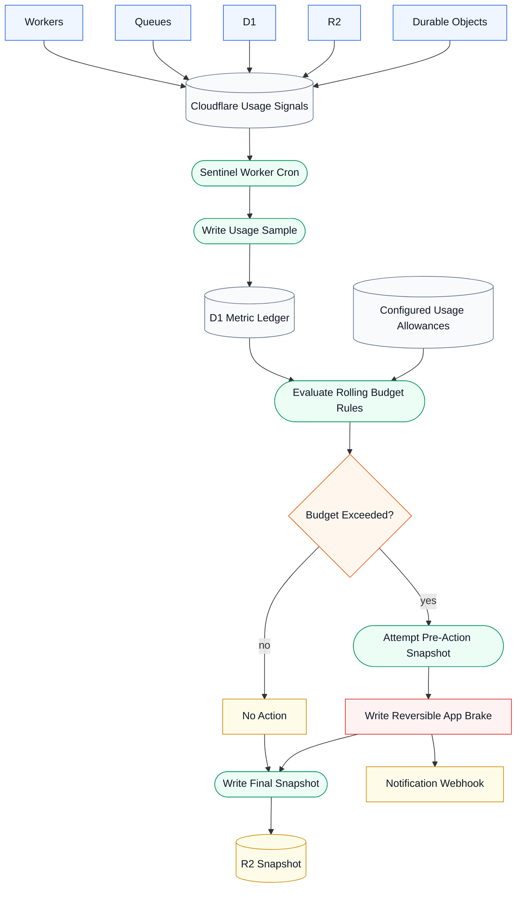

# Serverless Sentinel

Serverless Sentinel is a toolkit to integrate configurable brakes into your Cloudflare infrastructure to prevent runaway usage spending, as you see fit.
It is independent and is not affiliated or developed by Cloudflare.

It is designed for agent-assisted adoption: point an agent at this repository and have it audit your Cloudflare architecture. You adapt and extend the reference implementation Worker and budget rules to your app. The operator should review the audit, policy thresholds, brake scope, and validation evidence before enabling reversible brake protection, _especially_ in production. A brake on a production app could be disruptive, so be meticulous.

## What It Does

Serverless Sentinel observes and records Cloudflare platform usage, evaluates rolling budget rules, writes audit snapshots, activates a reversible app brake when configured critical rules trip, and sends a webhook notification after a fresh brake write.

It does not purge queues, delete resources, disable Workers, or perform destructive Cloudflare control-plane actions by default. It enables a brake action. You can extend this as you wish.

The intended adoption sequence is:

1. Map the parts of the app that can create billable Cloudflare work: public request handlers, scheduled jobs, queue producers and consumers, Durable Objects, D1 queries, R2 operations, Workers AI calls, and retry or repair paths.
2. Look for self-amplifying loops before adding automation. In Cloudflare infrastructure, these often look like a queue consumer that re-enqueues too aggressively, a scheduled Worker that keeps waking itself, a retry path that does expensive work after a no-op, or a fanout path where one event can create many downstream events without a durable coalescing key or hard limit.
3. Harden the obvious risky paths first. Prefer durable state before enqueueing, idempotent consumers, bounded retries, bounded fanout, stable wake identities, and no-op exits that stop spending.
4. Start in read-only observation mode. The first goal is to prove the sentinel can see the right usage signals, write snapshots, and describe normal idle and known-good workload behavior without being able to pause the app.
5. Configure rolling budget rules from two sources: observed traffic and operator-defined allowances. Observed traffic tells you what normal spikes and sustained workload look like; allowance budgets tell you how much of your hourly, daily, weekly, or monthly Cloudflare plan usage you are willing to spend in a given window.
6. Enable only narrow reversible brakes after controlled validation proves the action path. A brake should stop new work at clear admission or producer boundaries, notify you, and be easy to inspect and clear.

## Architecture



## Agent Quick Start

This is an agent-assisted workflow, not a fully autonomous setup. The operator should review the audit, budget thresholds, brake scope, and validation evidence before enabling protect mode.

Give your coding agent a prompt like:

```text
Use the Serverless Sentinel skill in this repository to guide me through adapting it to my Cloudflare app. Start by auditing my architecture for runaway billable-operation risks, then identify the configuration choices I need to make before you adapt the reference implementation Worker, budget rules, and reversible app-brake checks. Do not enable protect mode until we have reviewed the policy thresholds, app-brake impact, notification setup, and validation evidence together.
```

Then the agent should:

1. Load `skills/cloudflare-sentinel/SKILL.md`.
2. Run the audit workflow against the target codebase and Cloudflare architecture.
3. Adapt the Cloudflare reference implementation Worker, D1 schemas, R2 snapshot bucket, and budget rules.
4. Add app-side brake checks at admission and producer boundaries.
5. Run the validation playbook before leaving actions enabled.

## How Agents Load It

Serverless Sentinel supports two loading modes:

- **Repository mode:** point an agent at this repository and instruct it to read `skills/cloudflare-sentinel/SKILL.md` first. This works with any coding agent that can read files from a repository.
- **Installed skill mode:** copy or install `skills/cloudflare-sentinel/` into the agent's skill directory, if the agent runtime supports skills. The skill metadata triggers the workflow, and the reference files are loaded only when needed.

In both modes, the skill is the workflow. The Worker, policy, migrations, and brake checks are reference implementations the agent adapts to the target architecture. 

## What You Provide

- Cloudflare account ID.
- Read-only Cloudflare observer API token for resource usage.
- R2 bucket for audit snapshots; required before protect mode.
- D1 database for the sentinel metric ledger; optional for observation, required for protect mode.
- Application state store for the reversible app brake; optional for observation, required for protect mode.
- Budget rules and allowance values that match the target Cloudflare plan and architecture.
- Optional webhook URL and Discord user ID, stored as platform secrets.

Most deployments require a configuration planning stage. The agent should recommend sensible choices for sentinel cadence, protected metrics, allowance values, policy thresholds, brake release mode, validation workload, notification channel, and sentinel mode, then confirm high-impact choices before enabling protect mode.

The bundled Workers Paid-shaped allowance and policy reference files are starting points for development or low-traffic validation. They can inform production configuration, but should not be copied into production blindly. Production thresholds should reflect real user traffic, legitimate peak workloads, support/on-call expectations, false-positive impact, and the cost of blocking new work for active users.

## Safety Model

- Observer credentials stay read-only.
- The default action is a narrow reversible app brake.
- Action writes use an app-owned state binding, not the read-only observer token.
- Protection notifications run only after a fresh successful brake write. Observe-mode would-brake notifications require explicit opt-in and must say no action was taken.
- Repeated active brakes do not spam notifications.
- Policy gaps, stale data, or unsupported metrics block action eligibility instead of guessing.
- Queue bindings are used for `metrics()` only; the reference implementation Worker must not call `send()` or `sendBatch()`.
- Destructive actions are intentionally out of scope for the default implementation.

## Policy Model

Budget rules evaluate collected metrics over `windowTicks`, where each tick is one scheduled sentinel run. With a five-minute cron, `1` tick is a spike check, `12` ticks is one hour, and `288` ticks is one day.

The reference implementation supports:

- `absolute_units`: a metric exceeds a fixed unit cap in the window.
- `allowance_fraction`: a metric burns more than a configured fraction of a daily or monthly allowance.

Use `warn` rules for diagnostics and `critical` rules only after metric coverage, freshness requirements, brake scope, and validation evidence are reviewed. Every rule must explicitly choose whether partial evidence can act or whether a complete clean window is required.

Treat `references/cloudflare/policy/reference-workers-paid.json` as a development-oriented starting shape, not a production policy. Production thresholds should come from current plan allowances, observed normal traffic, expected peak workloads, false-positive impact, and the cost of pausing new work. Detailed metric selection, freshness, policy sizing, Worker scope, and ledger behavior live in `skills/cloudflare-sentinel/references/cloudflare-metrics.md`.

## Metric Source Caveats

Cloudflare GraphQL Analytics is a spend-pressure signal, not Cloudflare billing source of truth. Cloudflare's GraphQL Analytics docs say these datasets should not be used as the measure for usage that Cloudflare bills, because billable traffic can exclude activity that GraphQL still counts as measurable usage.

In our validation, Workers GraphQL Analytics worked well enough for five-minute sentinel ticks in a development environment with integration testing. That does not make it billing truth or prove the same freshness or accuracy profile for production traffic. Treat GraphQL-backed rules as conservative usage-pressure guards and validate them against the target workload. Detailed GraphQL and lower-bound telemetry behavior lives in `skills/cloudflare-sentinel/references/cloudflare-metrics.md`.

## Repository Layout

```text
skills/cloudflare-sentinel/
  SKILL.md
  references/
    audit-workflow.md
    brake-design.md
    validation-playbook.md
    cloudflare-metrics.md

references/cloudflare/
  worker/
  migrations/
    ledger/
    app-brake/
  policy/
```

## Reference Implementation Worker

The Cloudflare reference implementation Worker is intentionally small. It shows the integration points an agent should adapt:

- queue binding `metrics()` sampling;
- Cloudflare GraphQL usage probing;
- R2 audit snapshots;
- D1 metric ledger writes;
- rolling budget rule evaluation;
- reversible app-brake writes;
- Discord-compatible webhook notification.

The bundled reference implementation currently collects only a starter set: Workers GraphQL additive deltas for `workers.requests`, `workers.errors`, and `workers.subrequests`, plus queue backlog and byte gauges from Queue binding `metrics()`. The workflow targets broader Cloudflare risks across Workers, Queues, D1, R2, Durable Objects, and other billable surfaces, but an adopter must expand metric collection before writing action-eligible rules for those surfaces.

`workers.subrequests` is collected as a fanout signal, not as a Workers Paid allowance metric. Before making any rule action-eligible, confirm the adapted Worker collects that metric and writes it to the D1 ledger. See `references/cloudflare/README.md` for Worker adaptation and `skills/cloudflare-sentinel/references/cloudflare-metrics.md` for metric, scope, ledger, and retention details.

## Validation Evidence

Do not publish raw live snapshots by default. Publish sanitized evidence summaries instead: scenario, expected signal, observed signal, and reproduction steps.

Do not enable protect mode until the validation playbook has produced evidence for observation, manual brake behavior, controlled action, repeated-active idempotence, degraded evidence, notification behavior, and restored normal config. See `skills/cloudflare-sentinel/references/validation-playbook.md`.

## Package Security

This repo uses pnpm with a committed lockfile and strict install controls because the reference implementation Worker depends on ordinary JavaScript tooling such as Wrangler, TypeScript, and Vitest. JavaScript package installs can execute dependency lifecycle scripts, so installs should be treated as code execution.

The pnpm workspace uses exact direct dependency versions, `pnpm-lock.yaml`, `minimumReleaseAge`, blocked exotic transitive sources, strict dependency builds, and an explicit build-script allowlist for reviewed Cloudflare/tooling dependencies. Use the lockfile-respecting install path in `references/cloudflare/README.md` when validating this repository. If you adapt the reference implementation into a project that uses another package manager, preserve the same posture: committed lockfile, pinned direct dependencies, reviewed lifecycle scripts, and reproducible CI installs.

## Status

The first supported target is Cloudflare Workers, Queues, D1, R2, Durable Objects, and related billable surfaces. This project is independent and is not affiliated with Cloudflare.


## Credits

Created by Eric Phillips. Developed with Codex and GPT-5.5.

## Forks

--Forked by Kane Flores on 6/17/2026
